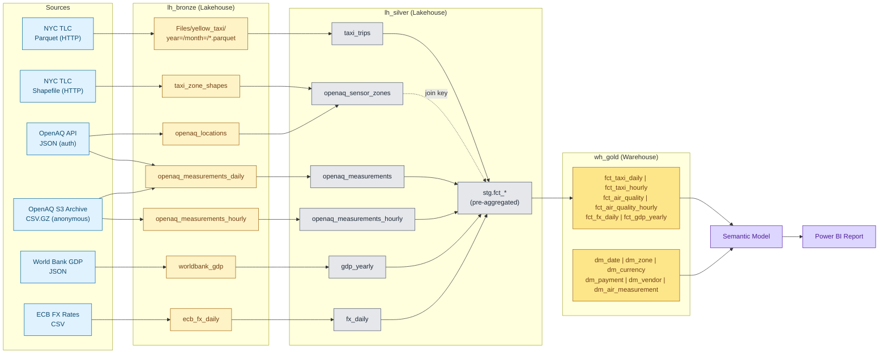

# Taxi | Air Quality | Economy - Microsoft Fabric Analytics Project

A unified data platform on Microsoft Fabric that ingests, transforms, and models three open-data domains - **NYC Yellow Taxi trips** (mobility), **OpenAQ measurements** (air quality), and **World Bank GDP + ECB FX** (economy) - into a **Bronze -> Silver -> Gold medallion lakehouse** with a star-schema warehouse for analytics.

The platform answers four cross-domain questions:

1. How does taxi traffic intensity relate to air quality in NYC?
2. Which zones and times of day show the strongest link between taxi demand and pollution peaks?
3. What is taxi revenue in USD vs EUR, and how does the exchange rate affect it?
4. Over multiple years, do mobility and economic growth come at the cost of environmental quality?

---

## Architecture



Orchestration is metadata-driven via a `wh_meta` Warehouse: per-partition status in `meta.ingestion_control`, source-of-truth watermarks in `meta.watermark`, run history in `meta.pipeline_run_log`. The platform uses a per-source master pattern: `pl_seed` runs once for slowly-changing reference data, and one master pipeline per source (`pl_master_taxi`, `pl_master_openaq_daily`, `pl_master_openaq_hourly`, `pl_master_fx`) handles the recurring incremental load for that source. See docs/architecture.md for the design rationale.

OpenAQ data is ingested via two complementary paths: incremental daily measurements via the OpenAQ API, and bulk hourly measurements via the public OpenAQ S3 archive. The dual path is intentional - the API is API-key-bound and rate-limited (50 req/min, free tier), suitable for incremental daily refreshes; the S3 archive is anonymous and bulk-friendly, suitable for hourly granularity and historical backfill. Daily and hourly facts coexist in the gold model.

---

## Data sources

| Source | Format | Ingestion method | Bronze landing | Refresh cadence |
|---|---|---|---|---|
| NYC TLC Yellow Taxi | Parquet | Data Pipeline (HTTP Copy -> file) | `Files/yellow_taxi/year=/month=/` | Per `pl_master` run, claim limit configurable |
| NYC TLC Taxi Zone Lookup | CSV | Notebook (HTTP Copy -> CSV) | `Files/reference/taxi_zone_lookup.csv` | On `pl_seed`, , `nb_gold_seed_dimensions` downloads if missing |
| NYC Taxi Zone shapefile | ESRI Shapefile | Notebook (geopandas, downloads if missing) | `lh_bronze.dbo.taxi_zone_shapes` | On `pl_seed`|
| OpenAQ - locations & sensors | JSON | Dataflow Gen2 (API key via Key Vault -> pipeline -> dataflow parameter) | `lh_bronze.dbo.openaq_locations` | On `pl_seed` (slowly-changing dim) |
| OpenAQ - daily measurements | JSON | Notebook (PySpark + `requests`, threaded with rate limiter) | `lh_bronze.dbo.openaq_measurements_daily` | Per `pl_master`, claim limit configurable |
| OpenAQ - hourly measurements | CSV.GZ | Notebook (anonymous S3, Spark CSV reader, aggregated to hourly grain) | `lh_bronze.dbo.openaq_measurements_hourly` | Per `pl_master`, separate state via `openaq_s3_hourly` source name |
| OpenAQ S3 archive (alt path, any parameter) | CSV.GZ | Notebook (parameterised; reusable for backfill of arbitrary pollutants) | `lh_bronze.dbo.openaq_measurements_daily` (daily grain) | On-demand / backfill |
| World Bank GDP | JSON | Dataflow Gen2 | `lh_bronze.dbo.worldbank_gdp` | On `pl_seed` (full history per request, low cadence) |
| ECB FX (USD/EUR daily) | CSV | Dataflow Gen2 | `lh_bronze.dbo.ecb_fx_daily` | Per `pl_master` run |
| Sensor parameter catalogue | CSV (committed) | Notebook (reads `Files/reference/sensor_parameters.csv`) | `wh_gold.dbo.dm_air_measurement` | On `pl_seed` |

---

## Repository layout

```
.
├── README.md                                    Project overview, prerequisites, run instructions
├── resources/                                   Committed assets uploaded to the workspace once
│   ├── Grafana-dashboard.json                   Exported Grafana dashboard
│   ├── wh_conn/                                   Custom Python helper for Warehouse connectivity
│   └── reference/                                 sensor_parameters.csv seeded into dm_air_measurement
├── docs/                                        Deep-dive documentation (see "Documentation" below)
│
├──integrations/                                 Notebooks for integrations with Telegram, Power Automate and Grafana
│
├── bronze/                                      All bronze-layer items
│   ├── nb_bronze_*                                Source-specific ingestion notebooks
│   ├── df_bronze_*                                Dataflow Gen2 ingestion (FX, GDP, OpenAQ locations)
│   ├── pl_bronze_*                                Bronze orchestration pipelines
│   └── openaq_s3_archive/                         Optional alt path: parameter-flexible S3 backfill
├── silver/                                      All silver-layer notebooks and pipelines
├── gold/                                        All gold-layer notebooks and pipelines
│
├── orchestrator/                                Top-level orchestration
│   ├── pl_seed.DataPipeline/                      One-off: dims, references, GDP, locations, sensor-zone map
│   ├── pl_master_taxi.DataPipeline/               Recurring: taxi end-to-end (daily + hourly gold parallel)
│   ├── pl_master_openaq_daily.DataPipeline/       Recurring: OpenAQ daily (API path)
│   ├── pl_master_openaq_hourly.DataPipeline/      Recurring: OpenAQ hourly (S3 path)
│   ├── pl_master_fx.DataPipeline/                 Recurring: ECB FX
│   └── legacy/pl_master.DataPipeline/             Earlier wide-master design, kept for reference
│
├── meta/                                        Orchestration metadata
│   ├── wh_meta.Warehouse/                         Tables + stored procedures (see docs/architecture.md)
│   └── nb_seed_partitions.Notebook/               Seeds meta.ingestion_control for a date range
│
├── libs/                                        Variable libraries and Spark environments
│   ├── bronze_source_names.VariableLibrary/       Source name constants used across pipelines
│   ├── storage_paths.VariableLibrary/             OneLake paths and warehouse endpoint
│   ├── mssql_env.Environment/                     PySpark env: mssql-python + wh_conn
│   └── env_geopandas.Environment/                 PySpark env: geopandas (for sensor↔zone spatial join)
│
├── lh_bronze.Lakehouse/                         Bronze lakehouse metadata
├── lh_silver.Lakehouse/                         Silver lakehouse metadata
├── wh_gold.Warehouse/                           Gold warehouse DDL (tables + views)
│
├── BI/taxi_air_economy.SemanticModel/           Published semantic model over wh_gold
└── NYC_Mobility_Air_Quality_Report.Report/      Power BI report consuming the semantic model
```

## Documentation

| Doc | What's in it |
|---|---|
| [docs/architecture.md](docs/architecture.md) | Medallion rationale, orchestration topology (per-source masters), the two ingestion patterns, watermark vs partition-status, dual-path OpenAQ design, why `stg.*` in lh_silver, failure handling |
| [docs/data-dictionary.md](docs/data-dictionary.md) | Every table in bronze, silver, gold, and metadata - column types, descriptions, partitioning, MERGE keys |
| [docs/runbook.md](docs/runbook.md) | First-time deployment, bootstrap, routine runs, all backfill / recovery SQL, monitoring queries, adding a new source |
| [docs/lineage.md](docs/lineage.md) | Source-to-gold data lineage diagrams (one per source family) + pipeline lineage |
| [docs/known-issues.md](docs/known-issues.md) | Honest list of current limitations, data-source caveats, out-of-scope items, future work |
| [docs/semantic-model.md](docs/semantic-model.md) | Relationships, DAX measures, report page mapping to the four analytical questions |
| [docs/dq-bot.md](docs/dq-bot.md) | Data Quality checking telegram bot |
| [docs/power-automate-export.md](docs/power-automate-export.md) | Power Automate integration for notification via email/app |
| [docs/grafana-weather.md](docs/grafana-weather.md) | Grafana dashboard with enriched weather data |

---

## Running the platform

### Prerequisites

- A Microsoft Fabric workspace with capacity that includes Lakehouse, Warehouse, Data Factory (Pipelines + Dataflow Gen2), Notebooks, and Power BI.
- An **Azure Key Vault** containing a secret named `openaq-key` holding a valid [OpenAQ API key](https://docs.openaq.org/).
- A Key Vault connection in Fabric and a Web activity HTTP linked service pointing at the vault's secrets endpoint.
- An HTTP linked service for the TLC source: base URL `https://d37ci.cloudfront.net/trip-data/`.

### Workspace setup (one-time)

1. Deploy all items in this repo to the target workspace (via Git integration or manual import).
2. Update `libs/storage_paths.VariableLibrary` with your workspace and lakehouse/warehouse IDs.
3. In Fabric, attach `mssql_env` and `env_geopandas` environments to the appropriate notebooks (custom environments published per `Libraries/PublicLibraries/environment.yml`).
4. The custom Python package `wh_conn` (provides `get_con`, `check_con` over `mssql-python` against the Fabric Warehouse SQL endpoint) must be uploaded into `mssql_env` as a workspace library.

### First run - seed

Run **`pl_seed`** with parameters:

- `date_from` = `2023-01`  (start month, inclusive)
- `date_to`   = `2024-12`  (end month, inclusive)

`pl_seed` will:

1. Seed `meta.ingestion_control` with one row per (source, month) for taxi and openaq.
2. Load the NYC taxi zone shapefile.
3. Fetch OpenAQ locations (parameterized API key from Key Vault).
4. Compute the sensor↔zone spatial mapping.
5. Load the World Bank GDP full history.
6. Load silver and gold for GDP.
7. Seed all gold dimensions.

### Recurring runs - per-source masters

Each source has its own master pipeline that can be triggered independently:

| Pipeline | Parameters | Initial backfill |
|---|---|---|
| `pl_master_taxi` | `claim_limit` (default 12) - month-partitions per run | Run twice for 24-month backfill, or set `claim_limit=24` once |
| `pl_master_openaq_daily` | `claim_limit` (default 12) | Run twice for 24-month backfill |
| `pl_master_openaq_hourly` | `claim_limit` (default 12) | Run twice for 24-month backfill |
| `pl_master_fx` | none | Single run pulls full ECB series |

For convenience, `pl_runall` invokes all four in parallel. See [docs/runbook.md](docs/runbook.md) for suggested cadences and [docs/known-issues.md](docs/known-issues.md) for the rationale on per-source vs wide master.

### Backfill / recovery

- **Re-run a failed partition**: `UPDATE meta.ingestion_control SET status='pending' WHERE source_name=? AND partition_key=?`.
- **Reset all stuck-running partitions**: `EXEC meta.bulk_reset_running @source_name='...', @layer='bronze', @new_status='pending'`.
- **Force silver replay**: set `silver_status='pending'` on the relevant rows. The silver pipeline picks them up next run.

---

## Design choices worth highlighting

| Decision | Rationale |
|---|---|
| **Two ingestion patterns** (per-partition state machine for taxi; bulk-claim + notebook loop for OpenAQ) | Taxi is HTTP file copy - pipeline owns the loop. OpenAQ is rate-limited API - notebook owns the loop with threading + rate limiter, updating partition's status individually in a loop is very inefficient compared to bulk update stored procedure activity in a pipeline. |
| **Bronze taxi = parquet files, not Delta** | TLC parquet is already columnar and partitioned. The first valuable transformation (schema normalisation across yearly schema drift) belongs at silver, not bronze. |
| **`stg.*` schema in `lh_silver`, then COPY to `wh_gold`** | Fabric Copy Activity has native Upsert (`writeBehavior: Upsert`) with merge-key support. Avoids cross-engine MERGE issues that Spark-to-Warehouse direct writes hit. |
| **Per-partition silver status for taxi only** | Taxi bronze to sivler is done via separate month-partition file access and can be done only for partitions needed/marked pending. FX/GDP/OpenAQ silver is derived from bronze table, uses watermark + MERGE - idempotent, replay is one-shot. |
| **GDP refreshed in `pl_seed`, not `pl_master`** | World Bank API returns the *full* history (1960-now) in one call. Refreshing every master run is wasteful and exposes the platform to upstream availability we don't need daily. |
| **API key via Key Vault -> Web Activity -> Dataflow parameter** | Solves Dataflow Gen2's lack of native secret support. The key never appears in pipeline logs (`secureOutput: true`). |
| **OpenAQ alternate S3 ingest path** | OpenAQ free-tier API is rate-limited (50 req/min). For large historical backfill, the public S3 archive is more efficient. Pipeline-selectable. |
| **Date-spine forward-fill for FX** | ECB doesn't publish on weekends/holidays. Silver fills forward so downstream joins on `date_key` don't lose taxi rows on those dates. |

---

## Known limitations and future work

- OpenAQ NYC coverage is sparse. After spatial-joining sensors to TLC zones, only a handful of Manhattan-core zones have any sensor at all. NO2 has zero in-zone sensors across the full study window; PM2.5 has the best coverage. This is a source limitation, surfaced honestly in the report's overview page.
- 24-month study window limits multi-year analysis. Q4 ("growth at the expense of environmental quality over multiple years") can be answered directionally but not as a long-term trend. Window chosen for source-recency and availability across all four domains.
- Power BI dashboards are minimal - semantic model + 4 report pages cover the analytical questions but are not production-styled.
- Gold dimension DDL types are auto-generated (`varchar(max)`) by the Spark->Warehouse writer. Production hardening: tighten to explicit lengths.
- Data quality currently filters silently. A future iteration would materialise rejected rows to a quarantine table with reason codes.
- Purview lineage and RLS are explicitly out of scope (marked optional in the brief).
- No production schedule is enabled. The platform is schedule-ready (idempotent, watermark-driven, partition-aware) but unscheduled for evaluation determinism.

See [`docs/known-issues.md`](docs/known-issues.md) for full details.