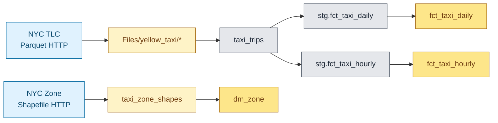
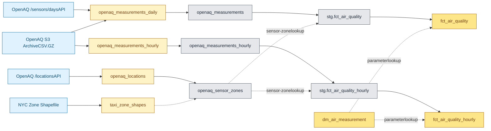
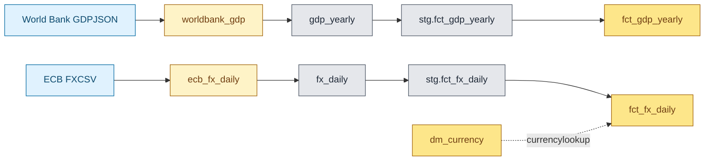
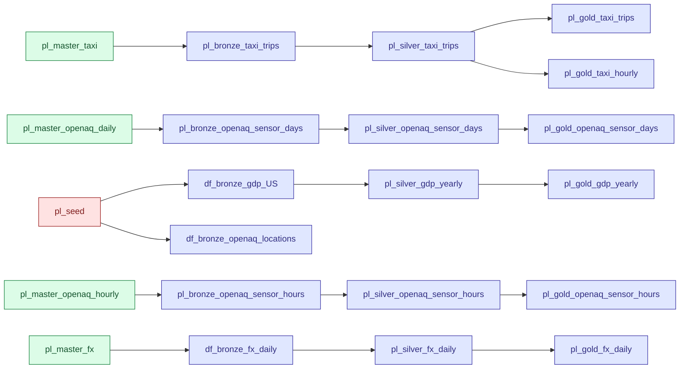

# Lineage

Two diagrams: **data lineage** showing source → bronze → silver → gold → BI flow per table, and **pipeline lineage** showing how the orchestration pipelines invoke each other. The data lineage is the "what flows where"; the pipeline lineage is the "what runs what".

## Data lineage

The platform processes four source families. Each is shown separately for clarity; the BI fan-in at the end shows how the gold layer feeds the semantic model.

### Taxi (mobility)

Hourly taxi is a re-aggregation of the same silver — no new ingestion. Zone shapefile feeds the gold dimension directly via `nb_gold_seed_dimensions` (the same shapefile separately also feeds the OpenAQ sensor↔zone join — see the air quality diagram).

### OpenAQ (air quality) — dual-path

Solid arrows are data flow; dotted arrows are join-key lookups. The S3 archive serves both daily and hourly bronze (daily for parameter backfill, hourly for time-of-day analysis). The API path feeds only daily bronze (rate limits make hourly impractical at scale). `openaq_sensor_zones` is built from two inputs and used as a lookup, not aggregated into a fact.

### Economy

GDP runs as part of `pl_seed`, not the recurring masters — the World Bank endpoint returns full history per call, so refreshing daily/weekly is wasteful. FX silver applies a date-spine forward-fill so weekend/holiday gaps don't break downstream joins on `date_key`.

### BI fan-in

Right now only 1 dimension: `dm_vendor` is not included into semantic model, as it doesn't provide any analytical value to the current project.

## Pipeline lineage

